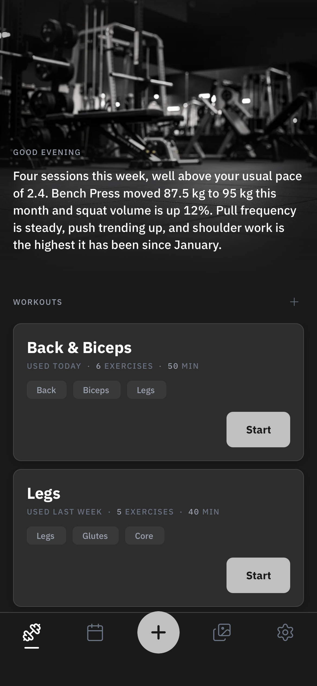
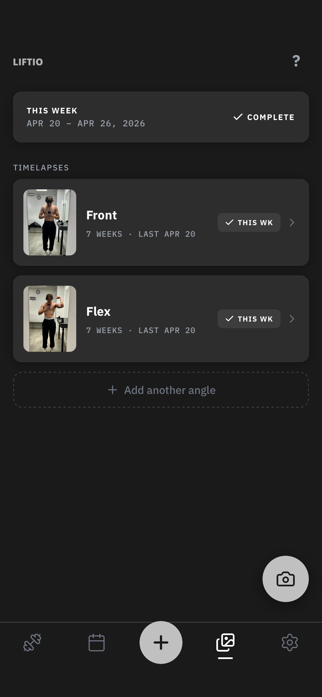
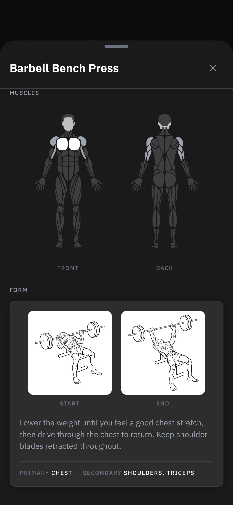

# Liftio

A native iOS app for tracking workouts and progressing training. Built to stay out of the way while you actually train.

**Live:** [App Store](https://apps.apple.com/gb/app/liftio/id6759969740) · [getliftio.com](https://www.getliftio.com/)

## What it does

- Fast workout logging with progressive overload tracking
- Clean and focused, stays out of the way while you train
- Native iOS

## Built with

React Native / Expo · TypeScript · Supabase

## Screenshots

  
  
  

---

A product of [MGKCodes](https://mgkcodes.com).
